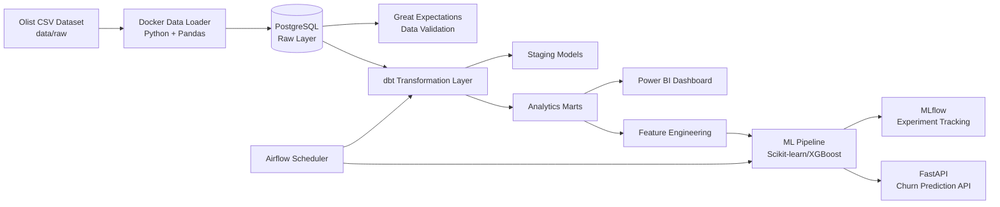
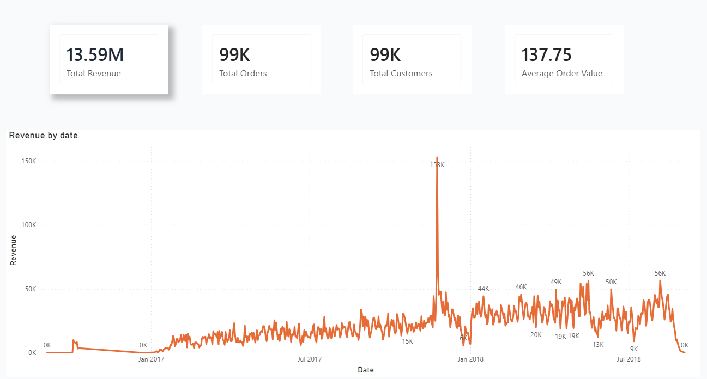
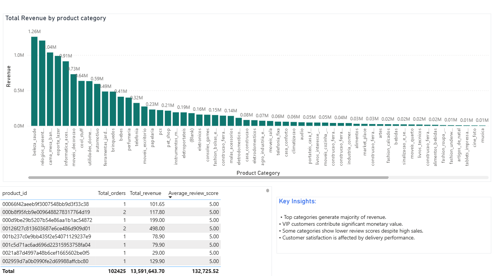

# Customer Analytics Platform

End-to-End Data Analytics & Machine Learning Platform

This project demonstrates an end-to-end analytics platform
built with modern data engineering, analytics and machine learning tools.

The goal is to analyze customer behavior, generate business insights,
and predict customer churn.
## Business Problem

E-commerce companies need to understand:

- Which customers generate the most value?
- Which products drive revenue?
- Which customers are at risk of churn?
- How can data support business decisions?

This project builds a complete analytics pipeline
to answer these questions.


## Architecture


## Docker Services

| Service | Purpose |
|---|---|
| postgres | PostgreSQL database storing raw and transformed data |
| data_loader | Python ETL container loading CSV files |
| airflow | Workflow orchestration and dbt execution |
| churn_api | FastAPI service for churn prediction |

## Tech Stack

### Data Engineering

- Python
- PostgreSQL
- Docker
- dbt
- Great Expectations


### Analytics

- SQL
- Pandas
- Power BI


### Machine Learning

- Scikit-learn
- XGBoost
- MLflow


### Deployment

- FastAPI
- Docker
- GitHub Actions

## Project Structure


customer-analytics-platform/

```text
.
├── data
│   └── raw
│       └── dataset files
│
├── data_loader
│   ├── Dockerfile
│   ├── requirements.txt
│   └── load_data.py
│
├── src
│   └── data ingestion
│
├── customer_analytics_dbt
│   └── transformation models
│
├── ml
│   ├── feature engineering
│   ├── training
│   └── models
│
├── api
│   └── FastAPI service
│
├── dashboard
│   └── Power BI dashboard
│
└── docker-compose.yml
```
## Data Pipeline


1. Data ingestion

Raw datasets are loaded into PostgreSQL using a dedicated Docker data loader service.

The loader reads CSV files from:

data/raw/

Expected files:

data/raw/
```text
├── olist_orders_dataset.csv
├── olist_order_items_dataset.csv
├── olist_products_dataset.csv
└── olist_order_reviews_dataset.csv
```
The data_loader container automatically imports these files into PostgreSQL.

2. Data validation

Great Expectations validates data quality.


3. Data transformation

dbt creates analytical models.


4. Analytics

Business KPIs are generated.


5. Machine Learning

Customer churn prediction model is trained.

## Dashboard Preview


### Executive Overview



### Products 



## Machine Learning Model


### Problem

Customer churn prediction.


### Features

- Recency
- Frequency
- Monetary Value
- Average Order Value


### Models Tested

- Logistic Regression
- Random Forest
- XGBoost


### Evaluation Metrics

- Accuracy
- Precision
- Recall
- ROC-AUC

Best Model:

Random Forest

ROC-AUC:
0.67


## How To Run


### Prerequisites

Make sure you have installed:

* Docker Desktop
* Docker Compose

No local Python environment is required because all services run inside Docker containers.

---

## 1. Clone Repository

```bash
git clone https://github.com/shokoufehyazdanian/Customer-Analytics-Platform.git
```

## 2. Dataset Setup

Raw datasets are not included in this repository because of their size.

Download the Brazilian E-Commerce Public Dataset by Olist from Kaggle:

https://www.kaggle.com/datasets/olistbr/brazilian-ecommerce

Extract the CSV files into:

```
data/raw/
```

Expected structure:

```
data/
└── raw/
    ├── olist_orders_dataset.csv
    ├── olist_order_items_dataset.csv
    ├── olist_products_dataset.csv
    ├── olist_order_reviews_dataset.csv
    ├── olist_customers_dataset.csv
    ├── olist_sellers_dataset.csv
    ├── olist_geolocation_dataset.csv
    ├── olist_order_payments_dataset.csv
    └── product_category_name_translation.csv
```

---

## 3. Start Docker Services

Build and start all services:

```bash
docker compose up --build -d
```

This starts:

| Service     | Description                              |
| ----------- | ---------------------------------------- |
| PostgreSQL  | Data warehouse database                  |
| Data Loader | Loads raw CSV files into PostgreSQL      |
| Airflow     | Workflow orchestration and dbt execution |
| FastAPI     | Churn prediction API                     |

---

## 4. Load Raw Data

The data_loader Docker service executes load_raw_data.py
and loads CSV files into PostgreSQL automatically during startup.

Check loading status:

```bash
docker logs customer_data_loader
```

Successful output:

```
Loading olist_orders_dataset.csv...
Loaded olist_orders_dataset: xxxx rows

Loading olist_products_dataset.csv...
Loaded olist_products_dataset: xxxx rows

Finished loading data
```

---

## 5. Run dbt Transformations

Note: dbt is installed inside the Airflow Docker container.

Open the Airflow container:
```bash
docker exec -it customer_airflow bash
```

Go to dbt project:

```bash
cd /opt/customer_analytics_dbt
```

Run transformations:

```bash
dbt run
```

Run data quality tests:

```bash
dbt test
```

---

## 6. Access Applications

### Airflow

Open:

```
http://localhost:8080
```

### FastAPI

API:

```
http://localhost:8000
```

Swagger documentation:

```
http://localhost:8000/docs
```

---
## Demo

### API Example

Endpoint:

POST /predict


Example request:

```json
{
  "recency": 30,
  "frequency": 5,
  "monetary": 450
}
```
Response: 
```json
{
  "churn_prediction": 0,
  "probability": 0.87
}
```

## 7. Stop Services

Stop all containers:

```bash
docker compose down
```

---

## Project Execution Flow

```
CSV Files
    |
    v
Data Loader Container
    |
    v
PostgreSQL
    |
    v
dbt Transformations
    |
    v
Analytics Models
    |
    v
Machine Learning Model
    |
    v
FastAPI Prediction API
```

All components run inside Docker containers to provide a reproducible environment.


## Future Improvements


- Cloud deployment (AWS/Azure)
- Data warehouse migration
- Real-time streaming pipeline
- Advanced ML monitoring
- Automated retraining
