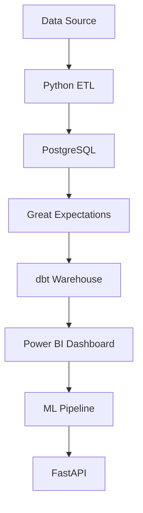

# Customer Analytics Platform

End-to-End Data Analytics & Machine Learning Platform

This project demonstrates an end-to-end analytics platform
built with modern data engineering, analytics and machine learning tools.

The goal is to analyze customer behavior, generate business insights,
and predict customer churn.
## Business Problem

E-commerce companies need to understand:

- Which customers generate the most value?
- Which products drive revenue?
- Which customers are at risk of churn?
- How can data support business decisions?

This project builds a complete analytics pipeline
to answer these questions.

## Architecture

## Tech Stack

### Data Engineering

- Python
- PostgreSQL
- Docker
- dbt
- Great Expectations

### Analytics

- SQL
- Pandas
- Power BI

### Machine Learning

- Scikit-learn
- XGBoost
- MLflow

### Deployment

- FastAPI
- Docker
- GitHub Actions

## Project Structure

customer-analytics-platform/

├── src/
│   └── data ingestion

├── customer_analytics_dbt/
│   └── transformation models

├── ml/
│   ├── feature engineering
│   ├── training
│   └── models

├── api/
│   └── FastAPI service

├── dashboard/
│   └── Power BI dashboard

└── docker-compose.yml

## Data Pipeline

1. Data ingestion

Raw datasets are loaded into PostgreSQL.

2. Data validation

Great Expectations validates data quality.

3. Data transformation

dbt creates analytical models.

4. Analytics

Business KPIs are generated.

5. Machine Learning

Customer churn prediction model is trained.

## Dashboard Preview

### Executive Overview

### Products 

## Machine Learning Model

### Problem

Customer churn prediction.

### Features

- Recency
- Frequency
- Monetary Value
- Average Order Value

### Models Tested

- Logistic Regression
- Random Forest
- XGBoost

### Evaluation Metrics

- Accuracy
- Precision
- Recall
- ROC-AUC

Best Model:

Random Forest

ROC-AUC:
0.67

## How To Run

Clone repository:

git clone YOUR_REPOSITORY_URL

Create environment:

python -m venv venv

Install dependencies:

pip install -r requirements.txt

Start services:

docker compose up -d

Run dbt:

cd customer_analytics_dbt

dbt run

Start API:

uvicorn api.app.main:app --reload

## Future Improvements

- Cloud deployment (AWS/Azure)
- Data warehouse migration
- Real-time streaming pipeline
- Advanced ML monitoring
- Automated retraining
